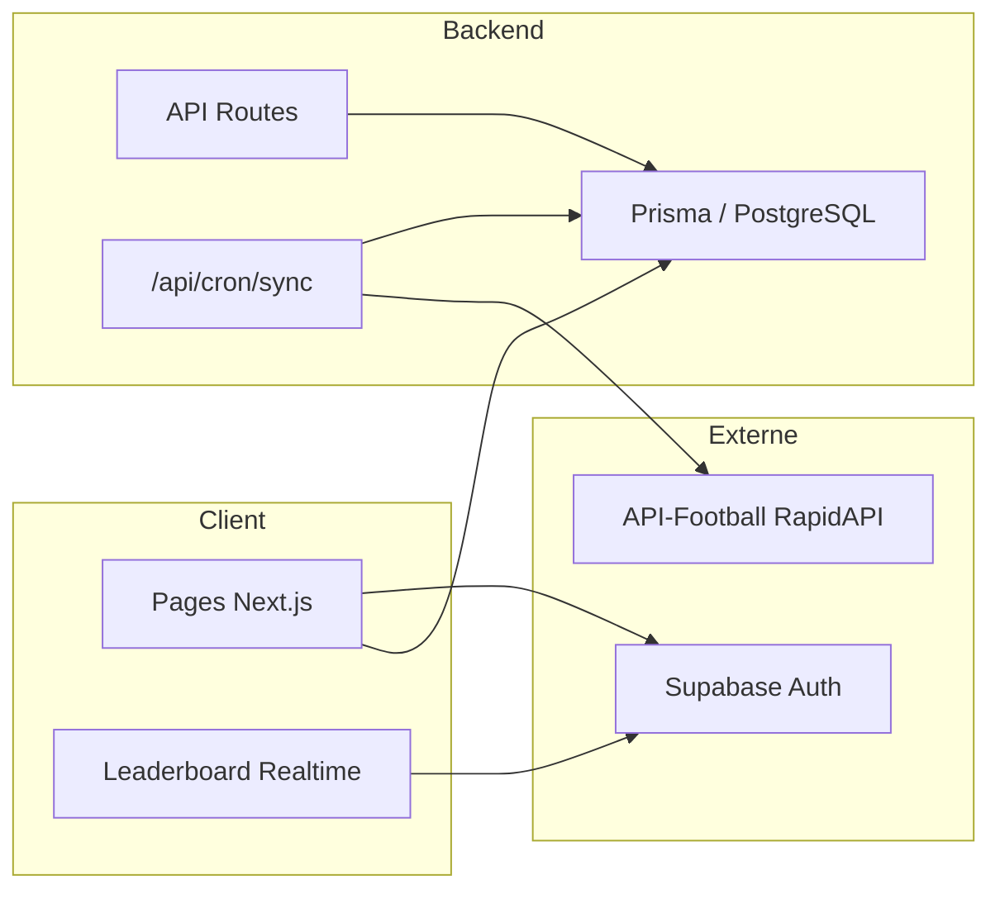

# Rapport de test QA — Ayeb Café Prediction

**Date :** 2 juin 2026  
**Environnement :** Windows, Node.js, `npm run dev` sur `http://localhost:3000`  
**Méthode :** revue de code (agent explore), lint/build CI, tests API (PowerShell), navigation automatisée (navigateur Cursor)

---

## 1. Synthèse exécutive

| Indicateur | Résultat |
|------------|----------|
| **Verdict global** | ⚠️ **Prêt pour le dev local, pas prêt pour la production** |
| Pages publiques | ✅ Fonctionnelles |
| Protection des routes privées | ✅ Redirection `/login` OK |
| API publiques (RSS, cron GET) | ✅ Répondent |
| Build production (`npm run build`) | ❌ **Échoue** (17 erreurs ESLint) |
| Parcours authentifié complet | ⏸️ Non testé (session requise) |
| Sécurité cron | ⚠️ GET non protégé |
| Scoring groupes / finalistes / awards | ⚠️ Non branché dans le cron |

**Recommandation prioritaire :** corriger le lint pour débloquer le build, sécuriser `GET /api/cron/sync`, afficher les erreurs d’auth à l’utilisateur, puis tester login/signup/predictions avec un compte de test.

---

## 2. Périmètre testé

### 2.1 Routes pages

| Route | Statut | Observations |
|-------|--------|--------------|
| `/` | ✅ PASS | Hero, CTAs, 3 cartes règles, footer |
| `/login` | ✅ PASS | Formulaire email/mot de passe, Google, onglets |
| `/login?tab=signup` | ✅ PASS | Champ nom d’affichage + « Create Free Account » |
| `/dashboard` (non connecté) | ✅ PASS | Redirige vers `/login` |
| `/predictions` (non connecté) | ✅ PASS | Redirige vers `/login` |
| `/leaderboard` | ✅ PASS | Charge ; 1 utilisateur en base (HTML ~28 Ko) |
| `/news` | ✅ PASS | 3 articles + lien RSS |

### 2.2 Routes API

| Endpoint | Test | Statut | Détail |
|----------|------|--------|--------|
| `GET /api/news/rss` | Automatisé | ✅ PASS | HTTP 200, `application/xml`, ~1787 octets |
| `GET /api/cron/sync` | Automatisé | ✅ PASS | `syncedFixturesCount: 8`, `processedMatchesCount: 0` |
| `GET /api/cron/sync?simulateMatchId=101&homeScore=2&awayScore=1` | Automatisé | ✅ PASS | Simulation 2-1, leaderboard recalculé |
| `POST /api/predictions` (sans session) | Automatisé | ✅ PASS | HTTP 401 `Unauthorized` |
| `POST /api/cron/sync` (prod + secret) | Non testé | ⏸️ | Nécessite `NODE_ENV=production` |
| `GET /api/auth/callback` | Non testé | ⏸️ | Nécessite flux OAuth Google |

### 2.3 Qualité / CI

| Commande | Statut |
|----------|--------|
| `npm run lint` | ❌ FAIL — 17 problèmes |
| `npm run build` | ❌ FAIL — bloqué par le lint |

**Erreurs ESLint :**

- `@typescript-eslint/no-explicit-any` : `api/cron/sync`, `api/predictions`, `PredictionsClient`, `apiFootball`, `auth-actions`
- `@typescript-eslint/no-unused-vars` : `news/rss` (NextResponse), `dashboard` (UserCheck, correctResultsCount), `LeaderboardClient`, `page.tsx`, `deadlines` (parseISO), `PredictionsClient` (hasPred)

### 2.4 Données (PostgreSQL / Prisma)

| Entité | Quantité |
|--------|----------|
| Utilisateurs | 1 |
| Matchs | 8 |
| Prédictions match | 0 |

Le seed/sync a bien peuplé 8 fixtures. Aucune prédiction en base au moment du test.

### 2.5 Console navigateur

Aucune erreur JavaScript applicative ; seuls avertissements internes Cursor Browser.

---

## 3. Tests fonctionnels détaillés

### 3.1 Authentification

| Cas | Résultat | Notes |
|-----|----------|-------|
| Accès `/dashboard` sans session | ✅ | Redirection `/login` |
| Accès `/predictions` sans session | ✅ | Redirection `/login` |
| Identifiants invalides | ❌ **BUG** | Reste sur `/login`, **aucun message d’erreur** |
| Inscription / Google OAuth | ⏸️ | Non exécuté (compte réel requis) |

**Cause du bug login :** `login()` / `signup()` retournent `{ error }` mais le formulaire n’utilise pas `useFormState` ; la page n’affiche que `searchParams.error`.

### 3.2 Prédictions & points

| Fonctionnalité | Statut |
|----------------|--------|
| Sauvegarde prédiction match (API) | ⏸️ Non testé (auth) |
| Fenêtre fermée après coup d’envoi | ⏸️ Revue code OK, pas validé en E2E |
| Scoring match via simulation cron | ✅ API OK ; 0 prédictions → 0 points attribués |
| Scoring groupes / finalistes / awards | ⚠️ **Non implémenté dans le cron** (`processGroupScoring`, etc. jamais appelés) |

### 3.3 Leaderboard & temps réel

| Cas | Résultat |
|-----|----------|
| Affichage liste utilisateurs | ✅ (1 user) |
| Mise à jour Realtime Supabase | ⏸️ Non validé (nécessite UPDATE en live + réplication) |

### 3.4 Contenu & SEO

| Cas | Résultat |
|-----|----------|
| Page news + titres | ✅ |
| Flux RSS | ✅ XML valide |
| Métadonnées page news | ✅ Titre dédié |

---

## 4. Architecture (rappel pour QA)

**Variables d’environnement requises :** `DATABASE_URL`, `NEXT_PUBLIC_SUPABASE_URL`, `NEXT_PUBLIC_SUPABASE_ANON_KEY`, `NEXT_PUBLIC_SITE_URL` ; optionnel `RAPIDAPI_KEY` ; `CRON_SECRET` en production pour POST cron.

---

## 5. Risques & anomalies (par priorité)

### P0 — Bloquant production

1. **Build échoue** à cause du lint (17 erreurs).
2. **`GET /api/cron/sync` non authentifié** — toute personne peut déclencher sync et simulation de scores en production.

### P1 — Expérience utilisateur

3. **Erreurs login/signup silencieuses** — échec d’auth sans feedback.
4. **Callback OAuth** — en cas d’échec, redirection vers `/dashboard` sans message.

### P2 — Fonctionnel / produit

5. **Points groupes, finalistes, awards** — logique présente dans `pointEngine.ts` mais **non appelée** par le cron.
6. **UI groupes** — seulement 1er/2e qualifiés ; règle « ordre complet +3 » non couverte côté UI.
7. **Verrous UI** — seuls les matchs sont verrouillés côté client ; autres onglets jusqu’au rejet API.

### P3 — Technique / dette

8. Imports Lucide inutilisés (lint).
9. `LeaderboardClient` : `useEffect` dépend de `[users]` → risque de resouscriptions Realtime.
10. Homepage promet Realtime sans polling — dépend de la config Supabase Replication.

### Sécurité opérationnelle

- Le fichier `.env` est présent localement et **ne doit pas être commité** (contient secrets DB, Supabase, RapidAPI, CRON).
- Vérifier que `.env` est dans `.gitignore` avant tout push.

---

## 6. Matrice de couverture

| Zone | Couverture |
|------|------------|
| Pages publiques | ~95 % |
| Auth E2E | ~30 % |
| API | ~60 % |
| Scoring métier | ~40 % (match simulé uniquement) |
| Realtime | 0 % (non validé) |
| Build / déploiement | 0 % (build KO) |

---

## 7. Plan de test manuel recommandé (suite)

1. Créer un compte test Supabase → vérifier ligne `User` Prisma sur `/dashboard`.
2. Sur `/predictions` : enregistrer un score pour match 101 → `POST /api/predictions` 200.
3. `GET /api/cron/sync?simulateMatchId=101&homeScore=X&awayScore=Y` → vérifier points sur dashboard et ledger.
4. Tester deadline : match passé → API 400 « Prediction window is closed ».
5. Onglets groupes / finalistes / awards → sauvegarde avant deadlines.
6. Confirmer qu’**aucun point** n’est attribué pour groupes/finalistes tant que le cron n’appelle pas les processors dédiés.
7. En `NODE_ENV=production` : `POST /api/cron/sync` sans Bearer → 401.
8. Deux navigateurs sur `/leaderboard` : déclencher points → animation Realtime.

---

## 8. Conclusion

L’application **démarre correctement en dev**, les **pages publiques et les API RSS/cron répondent**, et la **protection par redirection** des pages privées fonctionne. En l’état, elle **ne peut pas être déployée en production** tant que le build lint n’est pas corrigé et que le endpoint cron GET n’est pas sécurisé.

Les parcours cœur métier (prédictions, tableau de bord, classement live) nécessitent une **session utilisateur de test** pour une validation E2E complète.

---

*Rapport généré par agent de test automatisé (explore + navigateur + API).*
